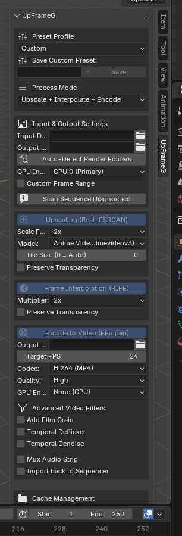

# UpFrameG

<p align="center">
  
</p>


**UpFrameG** is a powerful, portable, and fully asynchronous AI Post-Processing addon for Blender. It integrates state-of-the-art AI upscaling (Real-ESRGAN) and frame interpolation (RIFE) with high-efficiency video encoding (FFmpeg) directly inside Blender's interface.

With UpFrameG, you can upscale low-resolution render sequences, increase frame rates (or create ultra-smooth slow-motion), apply advanced temporal filters, and compile final videos without leaving Blender.

---

## Key Features

### 🌟 AI Processing & Acceleration
- **AI Upscaling (Real-ESRGAN)**: Scale up your render sequences by **2x, 3x, or 4x** using NCNN Vulkan models. Custom tile-size controls help manage VRAM footprints.
  - *Models included*: Highly optimized Anime Video (realesr-animevideov3).
- **AI Frame Interpolation (RIFE)**: Double (**2x**), quadruple (**4x**), or octuple (**8x**) your framerate using Real-Time Intermediate Flow Estimation.
- **Vulkan GPU Selection**: Choose specific GPUs for processing or run on CPU in low-spec environments.

### 🎬 Production-Grade Video Packaging
- **FFmpeg Video Encoding**: Compile upscaled/interpolated frames into final videos using H.264, H.265 (HEVC), or Apple ProRes codecs.
- **Hardware Acceleration**: Support for NVENC (Nvidia), AMF (AMD), and QSV (Intel) for blazingly fast video encoding.
- **Audio Muxing**: Automatically extract scene audio strips from Blender's Video Sequence Editor (VSE) or mux external audio files directly into your video.
- **Auto VSE Import**: Auto-import final video files back to the Sequencer at the active cursor position.

### 🎭 Transparency & Advanced Filters
- **Preserve Transparency**: Automated split-and-merge pipelines process RGB and Alpha channels separately to keep transparency intact.
- **Temporal Deflicker**: Smooth out brightness fluctuations and exposure variations across frames.
- **Temporal Denoise (hqdn3d)**: Filter high-frequency noise dynamically while preserving edge details.
- **Cinematic Film Grain**: Mux dynamic noise to mask upscaling artifacts and provide organic cinematic texture.

### 🛠️ Professional Workflow Utilities
- **Batch Processing Queue**: Queue up multiple folders, set individual presets, and run batch processing sequentially in the background.
- **Interactive Side-by-Side Comparison**: Automatically splits Blender's screen to open original vs. processed frames side-by-side in the Image Editor.
- **Sequence Diagnostics**: Scan input sequences to verify frame sizes, image formats, and detect missing frames or gaps before processing.
- **Custom Presets**: Save, reload, and delete custom processing configurations.
- **Portable Architecture**: Zero manual installation required for AI backends. The addon automatically detects binaries downloaded to Blender's standard configuration directory.

---

## Installation

1. **Download the Addon**:
   - Download the latest `upframeg.zip` from the [Releases](https://github.com/sloemo01/upframeg/releases/tag/v1.0.0) page.
2. **Install in Blender**:
   - Open Blender.
   - Go to `Edit > Preferences > Addons`.
   - Click `Install...` in the top right, select `upframeg.zip`, and click `Install Addon`.
   - Enable the addon by checking the box next to `Render: UpFrameG`.
3. **Auto-Setup AI Backends**:
   - Open the addon preferences foldout.
   - Click **Download** next to **Real-ESRGAN**, **RIFE**, and **FFmpeg**. The addon will automatically download, extract, and map the dependencies to Blender's user configuration folder (`CONFIG/upframeg_binaries`).
   - If you already have these executables on your system, you can manually point the paths to them, or click **Auto-detect Downloaded Binaries** to let the addon scan.

---

## How to Use

### Sidebar Panel Location
Once installed, open the 3D Viewport sidebar (`N` key) and look for the **UpFrameG** tab.

### Typical Workflow
1. **Set Directories**: Select your **Input Directory** (where your raw Blender render frames are) and **Output Directory** (where processed frames will be saved). Or click **Auto-Detect Render Folders** to automatically populate them based on your current project's render settings.
2. **Run Diagnostics**: Click **Scan Sequence Diagnostics** to check for gaps or image size mismatches.
3. **Choose a Preset or Mode**:
   - Select a pre-configured profile (e.g., `YOUTUBE_4K` or `MOTION_GRAPHICS`), or select **Custom** mode to adjust each stage manually.
4. **Configure Settings**:
   - Enable/disable Upscaling, Interpolation, and Encoding as needed.
   - Toggle **Preserve Transparency** if you rendered with a transparent background.
   - Enable **Temporal Deflicker** or **Temporal Denoise** under the video filters to polish the output.
5. **Process**:
   - Click **Process Sequence** to start background processing.
   - You can monitor real-time progress, ETA, and console logs directly in the panel.
   - Click **Compare Frames Side-by-Side** when done to view a split comparison of the results.

---

## Developer Guide

### Directory Structure
```text
upframeg/
├── __init__.py         # Addon registration & initialization
├── preferences.py      # Portable preferences & backend auto-detection
├── operators.py        # Pipeline runner, presets, queue, and helper operators
├── ui.py               # Panel layout and template list interfaces
├── upscale.py          # Real-ESRGAN execution and tiling wrapper
├── interpolate.py      # RIFE execution and alpha-channel splitting wrapper
└── encode.py           # FFmpeg command builder and temporal filtering chain
```

### Packaging from Source
To bundle the addon into a installable zip, run the python packaging script from the root directory:
```bash
python package_addon.py
```
This script generates `upframeg.zip`, excluding caching files, temporary blend files, and local binaries.

---

## License

This project is licensed under the **GNU General Public License v3 (GPL v3)** - see the [LICENSE](LICENSE) file for details.
